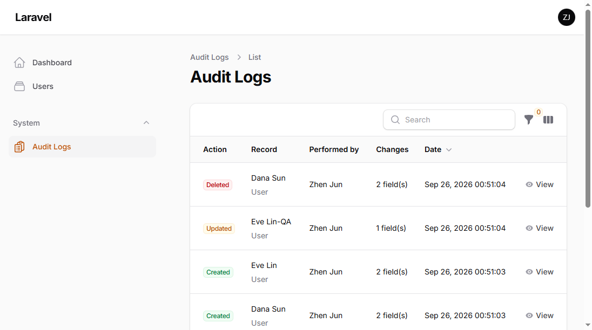
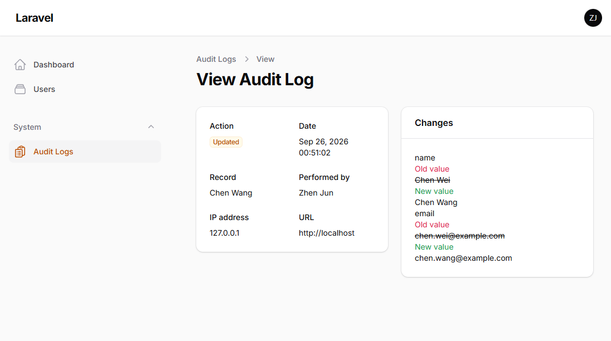
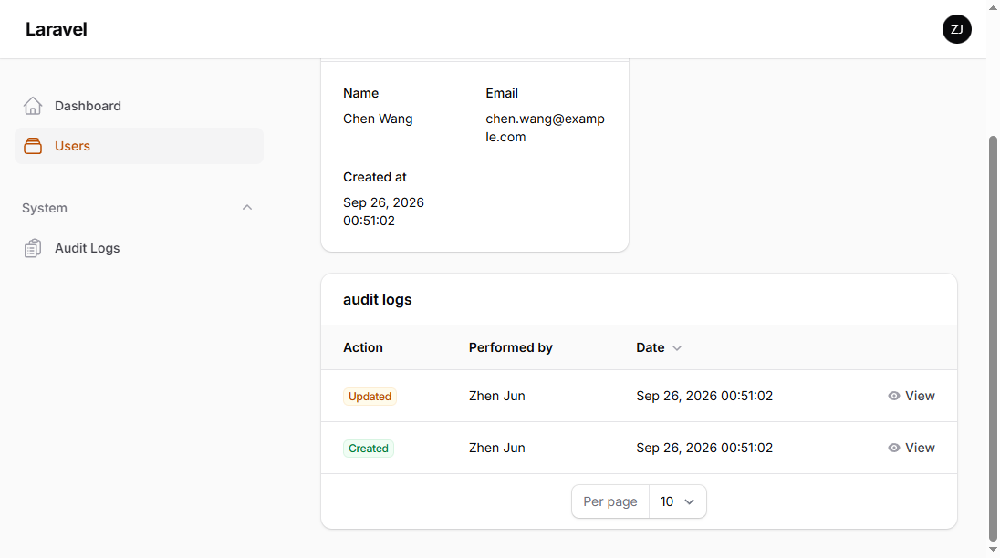

# Audit Trail for Filament

> Zero-config audit trail for Filament panels. Record **who** changed **what**, **when** — and review field-level diffs in a native, read-only UI.

Built for **Filament v5** · **PHP 8.2+** · **Laravel 11.28+**.

[](https://packagist.org/packages/zhenjun/filament-audit-trail)
[](https://packagist.org/packages/zhenjun/filament-audit-trail)
[](LICENSE.md)


[](https://github.com/3788322541/filament-audit-trail/stargazers)
[](https://github.com/3788322541/filament-audit-trail/actions/workflows/tests.yml)

---

## Screenshots

A read-only **Audit Logs** resource appears in your panel, with a filterable history list, a field-level diff on each entry, and a drop-in relation manager for any record.

**The full trail — filterable, with action badges and a per-entry change count:**



**Field-level diff on a single entry (old struck-through in red, new in green):**



**The bundled relation manager, dropped onto a record's own page:**



---

## Table of contents

- [Screenshots](#screenshots)
- [Why](#why)
- [Features](#features)
- [Requirements](#requirements)
- [Installation](#installation)
- [Quick start](#quick-start)
- [Viewing the trail](#viewing-the-trail)
- [Attaching the trail to a record](#attaching-the-trail-to-a-record)
- [Configuration](#configuration)
- [Customizing what gets recorded](#customizing-what-gets-recorded)
- [Controlling the actor & context](#controlling-the-actor--context)
- [Listening for events](#listening-for-events)
- [Retention & cleanup](#retention--cleanup)
- [Pro version](#pro-version)
- [License](#license)

---

## Why

Compliance officers, agencies and SaaS teams all ask the same question after an incident: *"who changed this, and what did it say before?"*

Rolling your own audit log means wiring model events, diffing dirty attributes, resolving the acting user across guards, storing context, and building a review screen. **Audit Trail does all of that for you** — drop a trait on a model and the history is recorded and rendered automatically.

- **Truly zero-config.** The migration is loaded by the service provider; the resource is registered by the plugin. No publishing, no copying files.
- **Native Filament UI.** A read-only resource plus a ready-to-use relation manager, styled with the core theme.
- **Field-level diffs.** Old vs. new values are stored as JSON and rendered as a red/green change view.

## Features

- ✅ Automatic recording of `created`, `updated`, `deleted` and `restored` events (soft-delete aware).
- ✅ Field-level diffs with old/new values, serialized for enums, dates and JSON.
- ✅ Sensitive attributes are never stored (passwords, tokens, timestamps by default).
- ✅ Actor resolution: Filament panel user → Laravel guard → explicit override.
- ✅ Request context: IP, user agent and URL, each individually toggleable.
- ✅ Console awareness: seeds/imports/jobs are tagged `console` or skipped entirely.
- ✅ Read-only Filament resource with filters, sortable columns and a diff detail view.
- ✅ Drop-in `RelationManager` to show a record's own history.
- ✅ `AuditContext::silent()` / `for()` / `tag()` to control recording at runtime.
- ✅ `AuditLogged` event for notifications, webhooks or streaming.
- ✅ `audit:purge` command + schedulable retention.

## Requirements

| Dependency | Version |
| --- | --- |
| PHP | `^8.2` |
| Filament | `^5.0` |
| Laravel | `^11.28` or `^12.0` |

## Installation

Install the package with Composer:

```bash
composer require zhenjun/filament-audit-trail
```

The service provider and the migration are **auto-discovered** — nothing else to run. The `audit_logs` table is created the next time you migrate:

```bash
php artisan migrate
```

Register the plugin on any panel that should expose the audit UI:

```php
use Zhenjun\AuditTrail\AuditTrailPlugin;

public function panel(Panel $panel): Panel
{
    return $panel
        ->plugins([
            AuditTrailPlugin::make(),
        ]);
}
```

<details>
<summary>Optional: publish the config or language files</summary>

```bash
php artisan vendor:publish --tag="filament-audit-trail-config"
php artisan vendor:publish --tag="filament-audit-trail-translations"
```

Publishing is **not required** — sensible defaults are used until you do.

</details>

## Quick start

Add the `Auditable` trait to any Eloquent model you want to track:

```php
use Illuminate\Database\Eloquent\Model;
use Zhenjun\AuditTrail\Concerns\Auditable;

class Product extends Model
{
    use Auditable;

    // ...
}
```

That's it. Every create/update/delete on `Product` is now written to `audit_logs` with a diff, an actor and request context.

## Viewing the trail

Once the plugin is registered, a read-only **Audit Logs** resource appears in your panel (under the `System` navigation group by default):

- **List** — every change with its action badge, affected record, actor, number of changed fields and timestamp. Filterable by event, searchable by record name.
- **Detail** — full metadata plus a side-by-side diff of old (removed) and new (added) values.

There are no create/edit/delete actions: the trail is append-only by design.

## Attaching the trail to a record

Want the history right next to the record it belongs to? Add the bundled relation manager to any page (typically a `ViewRecord` or `EditRecord` page):

```php
use Zhenjun\AuditTrail\Filament\RelationManagers\AuditLogRelationManager;

public function getRelationManagers(): array
{
    return [
        AuditLogRelationManager::class,
    ];
}
```

It reads the `auditLogs()` morph-many relationship that the `Auditable` trait already defines, so no extra wiring is needed.

## Configuration

All options live in `config/filament-audit-trail.php`:

| Key | Default | Description |
| --- | --- | --- |
| `user_model` | `App\Models\User::class` | Model used to render the actor column. |
| `user_name_column` | `'name'` | Column shown as the actor's name. |
| `auth_guard` | `null` | Guard used to resolve the actor outside a panel context. |
| `exclude_attributes` | `password`, `remember_token`, timestamps | Attributes never recorded, on every model. |
| `record_name_column` | `'name'` | Column stored with each log to identify the record even after deletion. |
| `record_url` | `true` | Store the request URL. |
| `record_ip` | `true` | Store the client IP. |
| `record_user_agent` | `true` | Store the user agent. |
| `record_console` | `true` | Record changes made in console (tagged `console`). Set `false` to skip. |
| `purge_days` | `365` | Default retention (days) used by `audit:purge`. |

## Customizing what gets recorded

**Globally**, edit `exclude_attributes` in the config.

**Per model**, list the primary key / timestamps are always excluded for you. To exclude additional fields, define `getAuditExcludeAttributes()`:

```php
public function getAuditExcludeAttributes(): array
{
    return ['secret_formula', 'internal_notes'];
}
```

To control the human-readable label stored alongside each log (shown after the record is deleted), either point `record_name_column` at the right column, or override it per model:

```php
public function getAuditRecordName(): ?string
{
    return $this->name . ' (' . $this->sku . ')';
}
```

## Controlling the actor & context

Outside an HTTP panel request — queue jobs, seeders, custom controllers — use the `AuditContext` helper:

```php
use Zhenjun\AuditTrail\Support\AuditContext;

// Attribute these changes to a specific user.
AuditContext::for($admin, function () {
    $product->update(['price' => 19.99]);
});

// Tag the resulting logs (useful for filtering / correlation).
AuditContext::tag('import:2026-09');

// Make changes without recording anything (bulk data migrations, tests).
AuditContext::silent(function () {
    Product::withoutTimestamps(fn () => $obsolete->delete());
});
```

## Listening for events

Every written log dispatches a `Zhenjun\AuditTrail\Events\AuditLogged` event carrying the `AuditLog` model — hook it for Slack alerts, webhooks, or shipping logs off-platform:

```php
use App\Listeners\NotifySecurity;
use Zhenjun\AuditTrail\Events\AuditLogged;

Event::listen(AuditLogged::class, [NotifySecurity::class, 'handle']);
```

## Retention & cleanup

Prune old entries with the bundled command:

```bash
php artisan audit:purge            # uses config('...purge_days')
php artisan audit:purge --days=90  # explicit retention window
```

Schedule it to run automatically:

```php
use Illuminate\Support\Facades\Schedule;

Schedule::command('audit:purge')->weekly();
```

## Pro version

The free tier covers recording, review UI and retention. **Audit Trail Pro** adds:

- 🏢 Multi-team / multi-tenant scoping (`team_id`).
- 🔗 Tamper-evident, hash-chained entries for compliance.
- 📤 CSV / Excel export and saved filtered views.
- 🧾 Relationship (pivot) auditing — `attached` / `detached`.
- 🎛️ Per-field visibility control and column whitelisting.

## Testing

Run the test suite (Pest + Orchestra Testbench) and the code style check (Laravel Pint):

```bash
composer test        # vendor/bin/pest
composer test:lint   # vendor/bin/pint --test
```

## Contributing

Please see [CONTRIBUTING](CONTRIBUTING.md) for setup, testing and pull-request guidelines, and [CHANGELOG](CHANGELOG.md) for what has changed in each release. Contributions are welcome — for larger changes, please open an issue first, and run `composer test` and `composer test:lint` before submitting a pull request.

## Sponsor

If Audit Trail saves you time, consider [sponsoring development](https://github.com/sponsors/3788322541) — it keeps the plugin maintained and helps fund the Pro features below.

## License

The MIT license (MIT). Free to use in personal and commercial projects.
